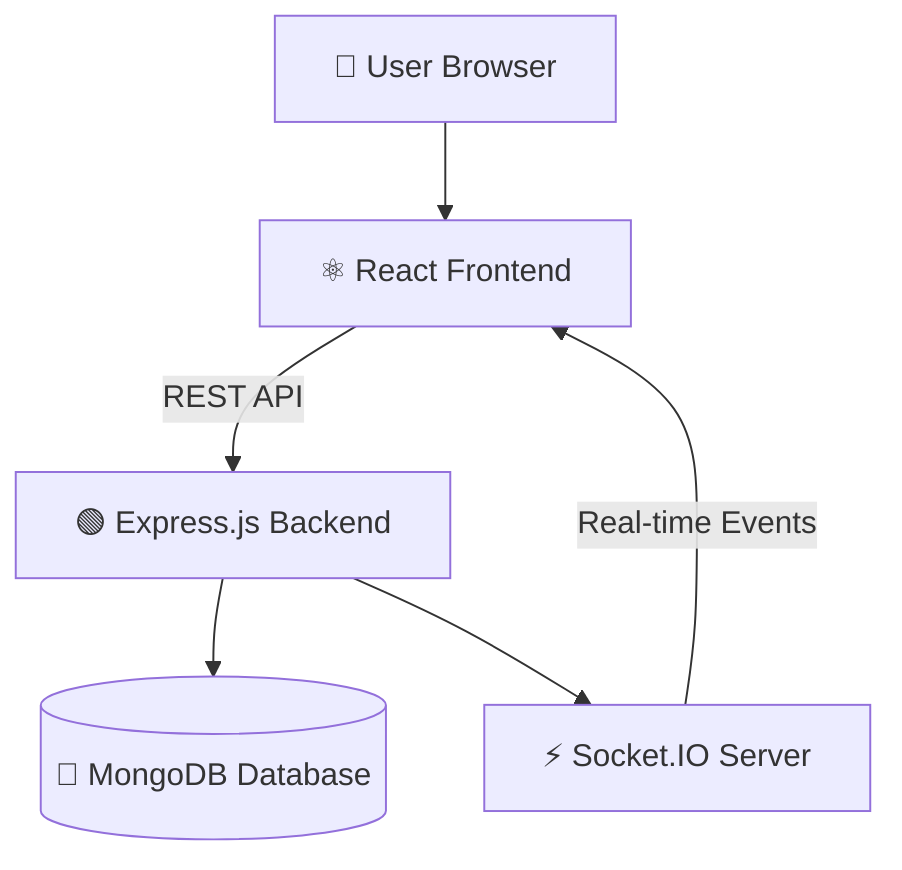
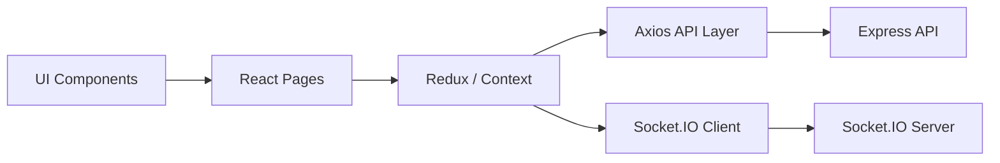
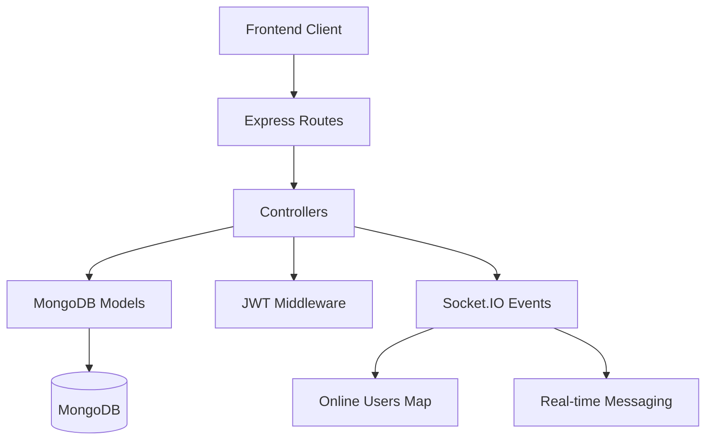

💬 WhatsApp Clone (MERN + Socket.IO)

  
 
  

🏆 Badges

     

🌍 Live Demo

🚀 Live App:
👉 https://whatsapp-gilt-alpha.vercel.app

💻 GitHub Repository:
👉 https://github.com/suvojitmanna/whatsApp_clone

🧠 Project Overview

A scalable real-time chat application inspired by WhatsApp, built with MERN + Socket.IO, enabling seamless communication with instant updates.

✨ Core Highlights  
⚡ Real-time bi-directional messaging  
🟢 Live user presence tracking  
🔐 Secure authentication (JWT)  
💬 Modern WhatsApp-like UI  
📡 Event-driven architecture  
🧱 MERN Stack

  

🧠 System Design (High-Level)
flowchart LR
    U[User] --> F[React Frontend]
    F -->|REST API| B[Express Backend]
    B --> DB[(MongoDB)]
    B --> S[Socket.IO Server]
    S -->|WebSocket| F
⚙️ Real-Time Message Flow (Deep Dive)
sequenceDiagram
    participant UserA
    participant FrontendA
    participant Server
    participant Socket
    participant FrontendB
    participant UserB

    UserA->>FrontendA: Send Message
    FrontendA->>Server: API Call (store message)
    Server->>DB: Save Message
    Server->>Socket: Emit Event
    Socket->>FrontendB: Receive Message
    FrontendB->>UserB: Display Message
🔥 Features  
💬 Messaging  
Instant message delivery (Socket.IO) 
Typing indicators (optional future)  
Read receipts (extendable)  
🧑‍🤝‍🧑 User System  
JWT Authentication  
Online/offline presence  
User session handling  
🎨 UI/UX  
WhatsApp-inspired interface
Responsive design
Smooth chat experience
🖼 Demo Preview (Add Your GIF Here)

 
 

👉 Replace this with your real app recording using:

ScreenToGif
OBS Studio
📊 GitHub Insights

   

📈 Contribution Activity

  

🏆 Achievements

  

🧱 Architecture Diagram

## 🖥️ Frontend Architecture

## 🛠️ Backend Architecture

## 🧩 Project Structure
client/
 ├── components/
 ├── pages/
 ├── redux/
 └── socket/

server/
 ├── controllers/
 ├── routes/
 ├── models/
 ├── middleware/
 └── socket/
⚙️ Installation
git clone https://github.com/suvojitmanna/whatsApp_clone.git

# Install dependencies
cd client && npm install
cd ../server && npm install
▶️ Run Application
# backend
npm run dev

# frontend
npm start  
🔐 Environment Variables
MONGO_URI=your_mongodb_uri
JWT_SECRET=your_secret
PORT=5000 
🔗 API Endpoints
Method	Endpoint	Description
POST	/api/auth/register	Register
POST	/api/auth/login	Login
GET	/api/messages	Fetch messages
POST	/api/messages	Send message 
🚀 Future Enhancements  
📞 Voice & Video Calling (WebRTC)  
📎 File/Image Sharing  
👥 Group Chats  
🔔 Push Notifications  
🌐 Multi-device sync  
🤝 Contributing  
git checkout -b feature-name
git commit -m "Add feature"
git push origin feature-name
⭐ Support

If you like this project:

⭐ Star the repo  
🍴 Fork it  
📢 Share it  

👨‍💻 Author

Suvojit Manna
GitHub: https://github.com/suvojitmanna

📜 License

MIT License

👁 Visitors

  

🎯 Footer

  

